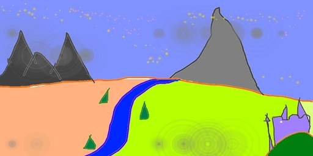
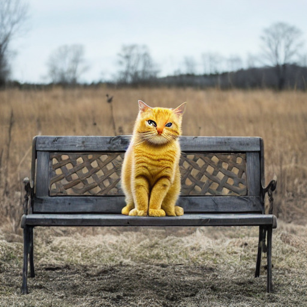

# diffusers-rs: A Diffusers API in Rust/Torch

[](https://github.com/LaurentMazare/diffusers-rs/actions)
[](https://crates.io/crates/diffusers)
[](https://docs.rs/diffusers)


_A rusty robot holding a fire torch_, generated by stable diffusion using Rust and libtorch.

The `diffusers` crate is a Rust equivalent to Huggingface's amazing
[diffusers](https://github.com/huggingface/diffusers) Python library.
It is based on the [tch crate](https://github.com/LaurentMazare/tch-rs/).
The implementation is complete enough so as to be able to run Stable Diffusion
v1.5 and v2.1.

In order to run the models, one has to get the weights from the huggingface
model repo [v2.1](https://huggingface.co/lmz/rust-stable-diffusion-v2-1)
or [v1.5](https://huggingface.co/lmz/rust-stable-diffusion-v1-5), move them in
the `data/` directory and then can run the following command.

```bash
cargo run --example stable-diffusion --features clap -- --prompt "A rusty robot holding a fire torch."
```

The final image is named `sd_final.png` by default.
The only supported scheduler is the Denoising Diffusion Implicit Model scheduler (DDIM). The
original paper and some code can be found in the [associated repo](https://github.com/ermongroup/ddim).

## FAQ

### Memory Issues

This requires a GPU with more than 8GB of memory, as a fallback the CPU version can be used
but is slower.

```bash
cargo run --example stable-diffusion --features clap -- --prompt "A very rusty robot holding a fire torch." --cpu all
```

For a GPU with 8GB, one can use the [fp16 weights for the UNet](https://huggingface.co/runwayml/stable-diffusion-v1-5/tree/fp16/unet) and put only the UNet on the GPU.

```bash
PYTORCH_CUDA_ALLOC_CONF=garbage_collection_threshold:0.6,max_split_size_mb:128 RUST_BACKTRACE=1 CARGO_TARGET_DIR=target2 cargo run \
    --example stable-diffusion --features clap -- --cpu vae --cpu clip \
    --unet-weights data/unet-fp16.safetensors
```

## Examples

A bunch of rusty robots holding some torches!


## Image to Image Pipeline

The stable diffusion model can also be used to generate an image based on
another image. The following command runs this image to image pipeline:

```bash
cargo run --example stable-diffusion-img2img --features clap -- --input-image media/in_img2img.jpg
```

The default prompt is "A fantasy landscape, trending on artstation.", but can
be changed via the `-prompt` flag.




## Inpainting Pipeline

Inpainting can be used to modify an existing image based on a prompt and modifying the part of the
initial image specified by a mask.
This requires different unet weights `unet-inpaint.safetensors` that could also be retrieved from this
[repo](https://huggingface.co/lmz/rust-stable-diffusion-v1-5) and should also be
placed in the `data/` directory.

The following command runs this image to image pipeline:

```bash
wget https://raw.githubusercontent.com/CompVis/latent-diffusion/main/data/inpainting_examples/overture-creations-5sI6fQgYIuo.png -O sd_input.png
wget https://raw.githubusercontent.com/CompVis/latent-diffusion/main/data/inpainting_examples/overture-creations-5sI6fQgYIuo_mask.png -O sd_mask.png
cargo run --example stable-diffusion-inpaint --features clap --input-image sd_input.png --mask-image sd_mask.png
```

The default prompt is "Face of a yellow cat, high resolution, sitting on a park bench.", but can
be changed via the `-prompt` flag.




## Converting the Original Weight Files

The weights can be retrieved as `.ot` files from
huggingface [v2.1](https://huggingface.co/lmz/rust-stable-diffusion-v2-1).
or [v1.5](https://huggingface.co/lmz/rust-stable-diffusion-v1-5).
It is also possible to download the weights for the original stable diffusion
model and convert them to `.safetensors` files by following the instructions below, these
instructions are for version 1.5 but can easily be adapted for version 2.1
using this [model repo](https://huggingface.co/stabilityai/stable-diffusion-2-1)
instead.

First get the vocabulary file and uncompress it.

```bash
mkdir -p data && cd data
wget https://github.com/openai/CLIP/raw/main/clip/bpe_simple_vocab_16e6.txt.gz
gunzip bpe_simple_vocab_16e6.txt.gz
```

### Clip Encoding Weights

For the clip encoding weights, start by downloading the weight file.

```bash
wget https://huggingface.co/openai/clip-vit-large-patch14/resolve/main/pytorch_model.bin
```

Then using Python, load the weights and save them in a `.safetensors` file.

```python
import numpy as np
import torch
from safetensors.torch import save_file

model = torch.load("./pytorch_model.bin")
tensors = {k: v.clone().detach() for k, v in model.items() if 'text_model' in k}
save_file(tensors, 'pytorch_model.safetensors')
```

### VAE and Unet Weights

The weight files can be downloaded from huggingface's hub but it first requires you to log in (and to [accept the terms of use](https://huggingface.co/runwayml/stable-diffusion-v1-5) the first time). Then you can download the [VAE weights](https://huggingface.co/runwayml/stable-diffusion-v1-5/blob/main/vae/diffusion_pytorch_model.bin) and [Unet weights](https://huggingface.co/runwayml/stable-diffusion-v1-5/blob/main/unet/diffusion_pytorch_model.bin).

After downloading the files, use Python to convert them to `npz` files.

```python
import torch
from safetensors.torch import save_file
  
model = torch.load('./vae.bin')
save_file(dict(model), './vae.safetensors')
  
model = torch.load('./unet.bin')
save_file(dict(model), './unet.safetensors')
```
